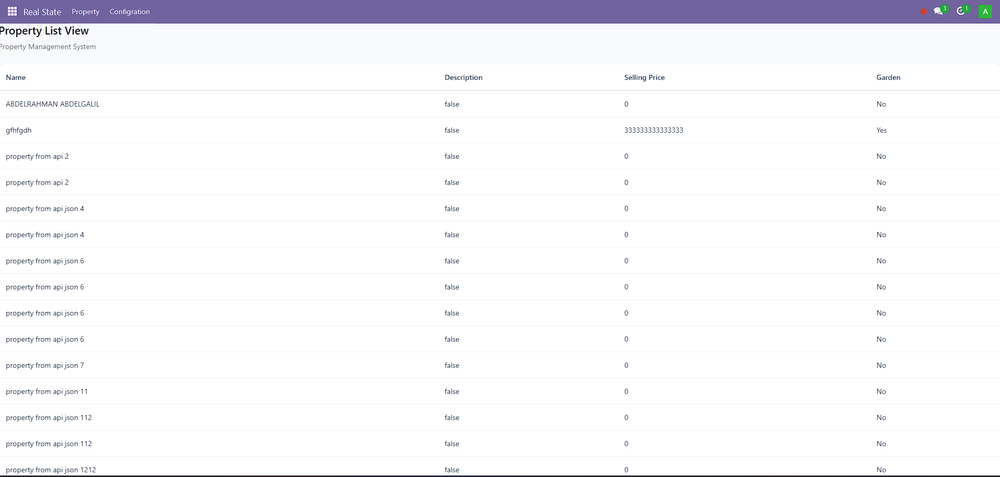

# Odoo Real Estate Management Module

## 📌 Description
Custom module built on Odoo for managing real estate properties, owners, and sales workflow. The module includes API endpoints, XLSX reports, and custom UI components.

## ✨ Features
- Property management
- Owner management
- Tags system
- Custom controllers API
- Excel report generation
- pdf report generation
- 

## 🛠 Technologies
- Python
- Odoo ERP
- XML Views

## 📥 Installation
1. Copy module folder into Odoo addons directory.
2. Restart Odoo server.
3. Update apps list.
4. Install module.

## 📷 Screenshots

## 👨‍💻 Author
Abdelrahman